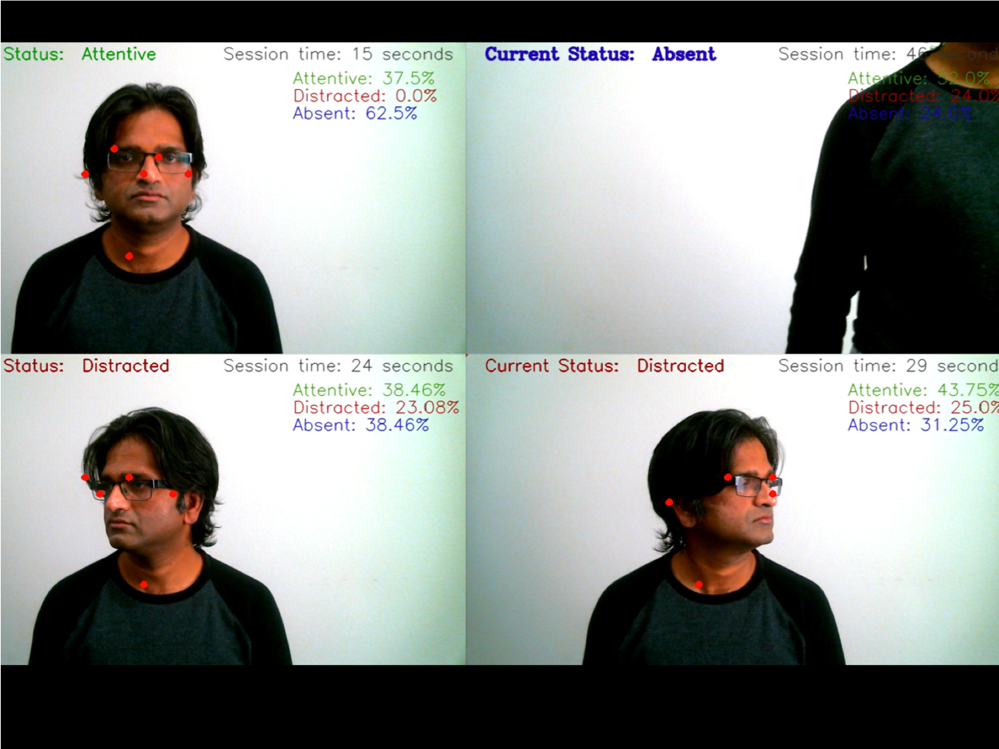
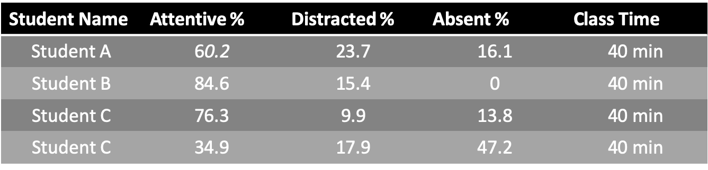

# Attention Prediction & Statistics for Classroom

This project was developed as an entry to the Intel sponsored [Deep Learning Superhero Challenge](https://www.hackster.io/contests/DLSuperheroes) on [Hackster](www.hackster.io)

Amid the global COVID-19 pandemic, while the frontline workers and health care professionals have worked tirelessly providing much needed care to the COVID victims, it would be remiss on our end to not acknowledge the challenges faced by people in other professions, especially the educators and teachers in schools.

With a government mandate in many cities to adopt remote based learning, this unprecedented and unfamiliar pedagogical method has many challenges, which is continuing to have a stressful impact on students, teachers and parents.

For instance, in our household, with working parents, it has been a daunting task these last few months to supervise our 7 year old to concentrate and not get distracted during his remote learning classes. One can only imagine this to be much more challenging for a teacher to keep track of 20 odd students if they are being attentive all the while executing the teaching activities for the day.

This application is aimed at assisting the teacher to monitor the students realtime and keep track of whether they are being "attentive/distracted/absent" during the class and generate a statistical report on the same. This report may be used to provide appropriate feedback to the students/parents for an effective learning experience.

The python script 'predict_attention.py' uses a command line keyword argument "--device" which could either use a CPU or VPU (virtual processing unit).

#### Sample video of script running

#### Hardware
In this project, [Intel Movidius Neural Compute Stick 2](https://store.intelrealsense.com/buy-intel-neural-compute-stick-2.html) was used as the VPU

#### Toolkits and libraries
* Intel OpenVino toolkit (4.5.0-openvino) was used to handle imageprocessing
* Other useful 3rd party libraries - numpy and imutils
* Deep Learning model (COCO/CAFFE) - [OpenPose](https://github.com/CMU-Perceptual-Computing-Lab/openpose)
